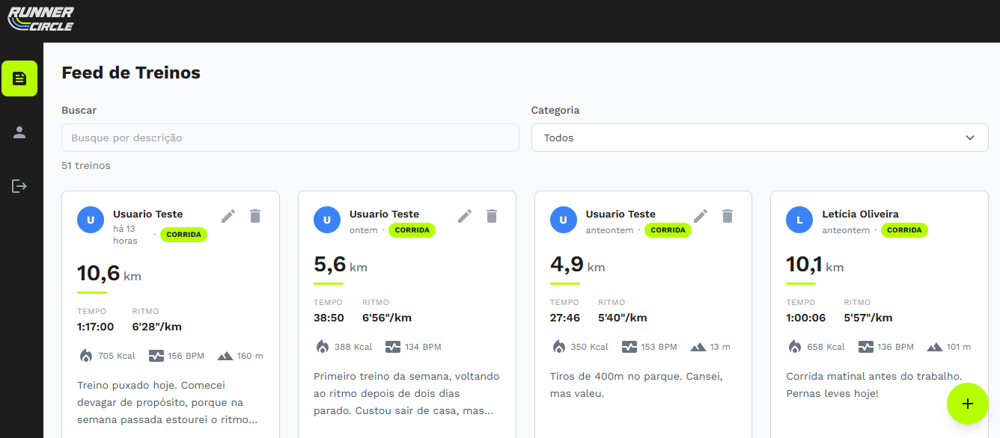

# Runner Circle



## 📖 Sobre

**Runner Circle** é uma rede social de treinos de corrida e caminhada desenvolvida com React. Os usuários publicam seus treinos — com tempo, distância, calorias, batimentos, ritmo e elevação — e acompanham um feed compartilhado, filtrável por categoria e por busca.

O projeto conta com um design moderno e responsivo, gráficos de evolução no perfil e metas de distância com prazo. 

---

## ✨ Funcionalidades

O **Runner Circle** oferece uma experiência completa para quem quer registrar e acompanhar a própria evolução:

- 🏃 **Feed de Treinos**
  - Acompanhe em um feed compartilhado os treinos publicados por todos os usuários.
  - Cada card mostra distância, tempo, ritmo, calorias, batimentos e elevação.
  - Paginação incremental: novas páginas são acumuladas conforme você avança.

- 🔎 **Busca e Filtros na URL**
  - Filtre o feed por categoria (corrida ou caminhada) ou busque pela descrição.
  - Os filtros ficam na URL (`/feed?categoria=corrida&busca=intervalado`): o link é
    compartilhável, o F5 preserva a seleção e o botão de voltar desfaz a escolha.

- 📝 **Gerenciamento de Postagens**
  - Crie, edite e exclua seus próprios treinos.
  - O ritmo é digitado como `MM:SS` e convertido na fronteira; elevação e ritmo são opcionais.

- 👤 **Perfil com Métricas**
  - Veja totais, metas de distância com prazo e gráficos de distância semanal e de ritmo.
  - Acesse também o perfil público de outros usuários do círculo.

- 🔐 **Autenticação e Rotas Protegidas**
  - Cadastro e login com estado centralizado em contexto.
  - Rotas privadas redirecionam para o login e devolvem o usuário à página de origem após autenticar.

- 📱 **Experiência Responsiva**
  - Layout adaptado para desktop e mobile, com navegação lateral no desktop e navegação inferior no celular.

---

## 🚀 Tecnologias Utilizadas

- **[React 19](https://react.dev/)**: Biblioteca para construção da interface de usuário.
- **[Vite](https://vitejs.dev/)**: Ferramenta de build e desenvolvimento rápido.
- **[React Router DOM](https://reactrouter.com/en/main)**: Para gerenciamento de rotas na aplicação.
- **[Apollo Client](https://www.apollographql.com/docs/react/)**: Cliente GraphQL com cache normalizado.
- **[GraphQL](https://graphql.org/)** + **[json-graphql-server](https://github.com/marmelab/json-graphql-server)**: Backend mock que gera a API GraphQL a partir de um seed local.
- **[MUI](https://mui.com/)** + **[MUI X Charts](https://mui.com/x/react-charts/)**: Componentes e gráficos.
- **[Tailwind CSS](https://tailwindcss.com/)**: Estilização utilitária.

---

## ⚙️ Como Executar o Projeto

Siga os passos abaixo para rodar o projeto em seu ambiente de desenvolvimento.

### Pré-requisitos

- [Node.js](https://nodejs.org/en) (versão 18 ou superior)
- [npm](https://www.npmjs.com/)

### Passos

1. **Clone o repositório:**
   ```bash
   git clone https://github.com/rodrisoares/react-runner-circle.git
   ```

2. **Acesse o diretório do projeto:**
   ```bash
   cd react-runner-circle
   ```

3. **Instale as dependências:**
   ```bash
   npm install
   ```

4. **Configure as variáveis de ambiente:**
   - Crie um arquivo `.env` na raiz do projeto a partir do `.env.example`:
     ```bash
     cp .env.example .env       # no Windows: copy .env.example .env
     ```
   - O valor padrão já aponta para o backend mock local:
     ```env
     VITE_API_URL=http://localhost:3001/graphql
     ```

5. **Execute a aplicação (dois terminais):**

   A aplicação precisa de **dois processos rodando ao mesmo tempo**.

   No **primeiro terminal**, suba o backend GraphQL mock:
   ```bash
   npm run server:json-graphql   # GraphQL em http://localhost:3001/graphql
   ```

   No **segundo terminal**, suba o frontend:
   ```bash
   npm run dev                   # aplicação em http://localhost:5173
   ```

A aplicação estará disponível em `http://localhost:5173` (ou em outra porta, caso a 5173 esteja em uso).

---

## 👥 Usuários de Teste

O seed do backend cria seis usuários, **todos com a senha `123123`**. O usuário principal
(`usuario@teste.com`) tem 12 semanas de histórico de treinos, metas ativas e dados nos gráficos;
os demais alimentam o feed público com postagens de exemplo.

| Nome             | E-mail              | Senha    | Observação                          |
| ---------------- | ------------------- | -------- | ----------------------------------- |
| Usuario Teste    | `usuario@teste.com` | `123123` | Principal (histórico + metas)       |
| Carlos Mendes    | `carlos@teste.com`  | `123123` | Autor de postagens de exemplo       |
| Marina Santos    | `marina@teste.com`  | `123123` | Autora de postagens de exemplo      |
| João Lima        | `joao@teste.com`    | `123123` | Autor de postagens de exemplo       |
| Letícia Oliveira | `leticia@teste.com` | `123123` | Autora de postagens de exemplo      |
| Rafael Costa     | `rafael@teste.com`  | `123123` | Autor de postagens de exemplo       |

> Você também pode criar uma nova conta pela tela de cadastro.

---

## 📜 Scripts

| Script                        | O que faz                             |
| ----------------------------- | ------------------------------------- |
| `npm run dev`                 | Servidor de desenvolvimento do Vite   |
| `npm run build`               | Build de produção                     |
| `npm run preview`             | Serve o build de produção localmente  |
| `npm run lint`                | ESLint em todo o projeto              |
| `npm run server:json-graphql` | Backend GraphQL mock (porta 3001)     |
